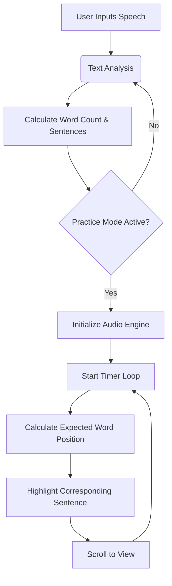

<div align="center">

  <!-- Badges -->
  
  
  [](https://aliriyaj007.github.io/SpeechRythm-light/)
  [](https://github.com/Aliriyaj007/SpeechRythm-light)

  <!-- Logo & Title -->
  <h1>SpeechRythm-light</h1>
  <p>
    <i>An intelligent speaking coach for timing, pacing, and delivery.</i>
  </p>

  <!-- Links -->
  [Live Demo](https://aliriyaj007.github.io/SpeechRythm-light/) &nbsp;•&nbsp; [Direct Download](https://github.com/Aliriyaj007/SpeechRythm-light/archive/refs/heads/main.zip) &nbsp;•&nbsp; [Documentation](#features)

</div>

---

## 📌 The Problem

Public speaking, presentations, and content creation often suffer from poor time management. Most speakers "guess" how long a speech will take, leading to rushed endings or awkward silences. Traditional rehearsal involves reading while glancing at a wall clock—a disconnect that destroys flow.

## ✨ The Solution

**SpeechRythm-light** is a utility-first, browser-based tool that visualizes your speech rhythm. It provides immediate feedback on your speaking rate (WPM), highlights sentences in real-time to keep you on track, and uses an integrated metronome to enforce steady pacing.

It is designed for developers, presenters, and students who value precision and data-driven feedback over fluff.

---

## 🚀 Usable in < 60 Seconds

1.  **Go to the [Live Demo](https://aliriyaj007.github.io/SpeechRythm-light/).**
2.  **Paste your speech** into the editor.
3.  **Click "Practice Mode".**
4.  **Read along** as the text highlights automatically.

That’s it. No account creation, no database, no tracking.

---

## ⚖️ Before vs. After

| Aspect | Before (Traditional) | After (SpeechRythm-light) |
| :--- | :--- | :--- |
| **Timing** | Guessing based on word count; running out of time. | Exact second-by-second calculation based on your WPM. |
| **Pacing** | Reading too fast when nervous, slowing down when thinking. | Visual pacing dot & metronome enforce consistent rhythm. |
| **Rehearsal** | Stopping to check a phone or wall clock. | Active sentence tracking keeps you focused on content. |
| **Privacy** | Uploading proprietary scripts to cloud services. | 100% Client-side processing. Your text never leaves your device. |

---

## 🏗️ Architecture & Flow

SpeechRythm-light is built using vanilla JavaScript (no frameworks) to ensure maximum performance and portability.



---

## 🛠️ Installation

SpeechRythm-light is zero-dependency. You can run it however you prefer.

### Method 1: Hosted Web App (Recommended)
Just open the link. No installation required.
**[🔗 Live Demo](https://aliriyaj007.github.io/SpeechRythm-light/)**

### Method 2: Direct Download
Download the ZIP file and double-click `index.html`.

**[⬇️ Download ZIP](https://github.com/Aliriyaj007/SpeechRythm-light/archive/refs/heads/main.zip)**

### Method 3: Clone Repository
For developers or offline usage via local server.

```bash
git clone https://github.com/Aliriyaj007/SpeechRythm-light.git
cd SpeechRythm-light
# Simply open index.html in your browser, or use a local server like Live Server
```

---

## ✨ Key Features

### 1. Precision Timing Engine
Calculates reading time based on your exact word count and adjustable WPM (Words Per Minute). Updates instantly as you edit.

### 2. Intelligent Sentence Tracking
The "Fix": Rewritten logic that calculates expected word position based on elapsed time.
*   It highlights the sentence you *should* be reading right now.
*   It automatically scrolls to keep the active sentence centered, allowing you to read from a distance.

### 3. Integrated Metronome
Uses the Web Audio API to generate crisp, rhythmic clicks that sync with your selected WPM.
*   Helps you slow down when you are rushing.
*   Helps you maintain energy when dragging.

### 4. Visual Pacing Dot
A progress indicator that moves across a track.
*   **Blue:** You are on track.
*   **Red:** You have exceeded your target time.

### 5. Privacy First
SpeechRythm-light does not use a backend. Your speech text remains in your browser's local memory and is never transmitted over the network.

---

## 🤝 Contributing

We appreciate contributions that align with our core philosophy: **Utility and Simplicity.**

If you want to contribute:
1.  Keep the code vanilla (no React/Vue/etc.).
2.  Ensure no external tracking or analytics are added.
3.  Focus on performance and accessibility.

See [CONTRIBUTING.md](CONTRIBUTING.md) for detailed guidelines.

---

## 📜 License

This project is open source and available under the [MIT License](LICENSE).

---

## 👤 Author & Contact

**Riyajul Ali**

<div align="center">

  [](https://github.com/Aliriyaj007)
  [](mailto:aliriyaj007@protonmail.com)
  [](https://linkedin.com/in/Aliriyaj007)

</div>
